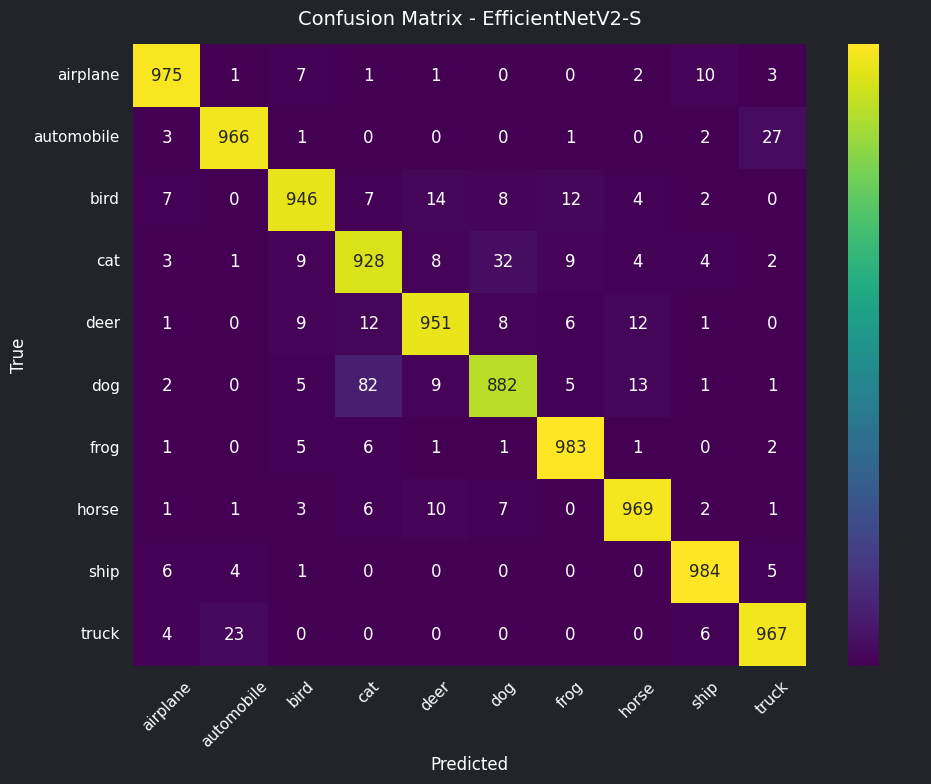
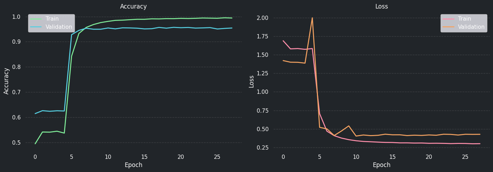

# Transfer Learning with EfficientNetV2-S (PyTorch)

## 1. Imports, seeds and paths


```python
import os
import sys
import random
import time
from pathlib import Path
import glob

import numpy as np
import pandas as pd

cwd = Path.cwd()
if cwd.name.lower() == "notebooks":
    project_root = cwd.parent
elif cwd.name.lower() == "cifar10_project":
    project_root = cwd
elif (cwd / "cifar10_project").is_dir():
    project_root = cwd / "cifar10_project"
else:
    project_root = None

if project_root is not None and str(project_root) not in sys.path:
    sys.path.insert(0, str(project_root))

from utils.ml_utils import (
    normalize_splits,
    format_duration,
    build_classification_report,
    compute_classification_metrics,
    compute_confusion_matrix,
    log_metrics_to_csv,
    plot_confusion_matrix_notebook01,
    plot_training_curves_notebook01,
)

# Fallback for mixed TF/PyTorch CUDA environments in WSL:
# expose CUDA/cuDNN libs from the dedicated PyTorch venv before importing torch
torch_venv = Path('/home/user/venvs/cifar10-torch')
if torch_venv.exists():
    py_ver = f"python{sys.version_info.major}.{sys.version_info.minor}"
    torch_site = torch_venv / 'lib' / py_ver / 'site-packages'
    nvidia_lib_dirs = glob.glob(str(torch_site / 'nvidia' / '*' / 'lib'))
    wsl_lib = '/usr/lib/wsl/lib'
    parts = [wsl_lib] + nvidia_lib_dirs
    existing = os.environ.get('LD_LIBRARY_PATH', '')
    if existing:
        parts.append(existing)
    os.environ['LD_LIBRARY_PATH'] = ':'.join(parts)

import torch
import torch.nn as nn
from torch.utils.data import Dataset, DataLoader
from torchvision import models, transforms
from torchvision.models import EfficientNet_V2_S_Weights

SEED = 42
random.seed(SEED)
np.random.seed(SEED)
torch.manual_seed(SEED)
torch.cuda.manual_seed_all(SEED)

device = torch.device('cuda' if torch.cuda.is_available() else 'cpu')
print(f'Using device: {device}')
print(f'Python executable: {sys.executable}')
print(f'Torch version: {torch.__version__}')
print(f'Torch path: {torch.__file__}')
print(f'Torch CUDA runtime: {torch.version.cuda}')
if torch.cuda.is_available():
    print(f'GPU: {torch.cuda.get_device_name(0)}')
else:
    print('CUDA not available in current kernel. Select kernel: cifar10-torch (PyTorch).')
```

    Using device: cuda
    Python executable: /home/user/venvs/cifar10-torch/bin/python
    Torch version: 2.10.0+cu128
    Torch path: /home/user/venvs/cifar10-torch/lib/python3.12/site-packages/torch/__init__.py
    Torch CUDA runtime: 12.8
    GPU: NVIDIA GeForce RTX 4060 Ti


```python
PROJECT_ROOT = Path.cwd()
if PROJECT_ROOT.name.lower() == 'notebooks':
    PROJECT_ROOT = PROJECT_ROOT.parent
elif PROJECT_ROOT.name.lower() != 'cifar10_project' and (PROJECT_ROOT / 'cifar10_project').is_dir():
    PROJECT_ROOT = PROJECT_ROOT / 'cifar10_project'

DATA_DIR = PROJECT_ROOT / 'data'
PROCESSED_DIR = DATA_DIR / 'processed'
MODELS_DIR = PROJECT_ROOT / 'models'
REPORTS_DIR = PROJECT_ROOT / 'reports'

MODELS_DIR.mkdir(parents=True, exist_ok=True)
REPORTS_DIR.mkdir(parents=True, exist_ok=True)

data_path = PROCESSED_DIR / 'cifar10_processed.npz'
performance_report_path = DATA_DIR / 'model_performance_report.csv'

print('Data path:', data_path)
print('Performance report path:', performance_report_path)
```

    Data path: /mnt/c/Users/User/Documents/Bootcamp AI and Data Science/Linux/DataScience_ironhack/Week6/project/cifar10_project/data/processed/cifar10_processed.npz
    Performance report path: /mnt/c/Users/User/Documents/Bootcamp AI and Data Science/Linux/DataScience_ironhack/Week6/project/cifar10_project/data/model_performance_report.csv


## 2. Load processed data


```python
data = np.load(data_path)

x_train = data['x_train'].astype(np.float32)
y_train = np.squeeze(data['y_train']).astype(np.int64)
x_val = data['x_val'].astype(np.float32)
y_val = np.squeeze(data['y_val']).astype(np.int64)
x_test = data['x_test'].astype(np.float32)
y_test = np.squeeze(data['y_test']).astype(np.int64)

splits = normalize_splits({
    'x_train': x_train,
    'x_val': x_val,
    'x_test': x_test,
}, scale=255.0, dtype='float32', clip_range=(0.0, 1.0))
x_train, x_val, x_test = splits['x_train'], splits['x_val'], splits['x_test']

class_names = ['airplane', 'automobile', 'bird', 'cat', 'deer', 'dog', 'frog', 'horse', 'ship', 'truck']
num_classes = len(class_names)

print('Train:', x_train.shape, y_train.shape)
print('Val:  ', x_val.shape, y_val.shape)
print('Test: ', x_test.shape, y_test.shape)
```

    Train: (40000, 32, 32, 3) (40000,)
    Val:   (10000, 32, 32, 3) (10000,)
    Test:  (10000, 32, 32, 3) (10000,)


## 3. Data pipeline with resizing to 96x96


```python
IMG_SIZE = 96
BATCH_SIZE = 64
NUM_WORKERS = 2

mean = [0.485, 0.456, 0.406]
std = [0.229, 0.224, 0.225]

train_transform = transforms.Compose([
    transforms.RandomHorizontalFlip(p=0.5),
    transforms.RandomResizedCrop(
        size=IMG_SIZE,
        scale=(0.85, 1.0),
        ratio=(1.0, 1.0),
    ),
    transforms.ColorJitter(
        brightness=0.2,
        contrast=0.2,
        saturation=0.2,
        hue=0.02,
    ),
    transforms.Lambda(lambda x: torch.clamp(x, 0.0, 1.0)),
    transforms.Normalize(mean=mean, std=std),
])

eval_transform = transforms.Compose([
    transforms.Resize((IMG_SIZE, IMG_SIZE)),
    transforms.Normalize(mean=mean, std=std),
])

class CifarArrayDataset(Dataset):
    def __init__(self, images, labels, transform=None):
        self.images = images
        self.labels = labels
        self.transform = transform

    def __len__(self):
        return len(self.images)

    def __getitem__(self, idx):
        image = torch.from_numpy(self.images[idx]).permute(2, 0, 1).float()
        label = int(self.labels[idx])
        if self.transform is not None:
            image = self.transform(image)
        return image, label

train_ds = CifarArrayDataset(x_train, y_train, transform=train_transform)
val_ds = CifarArrayDataset(x_val, y_val, transform=eval_transform)
test_ds = CifarArrayDataset(x_test, y_test, transform=eval_transform)

train_loader = DataLoader(train_ds, batch_size=BATCH_SIZE, shuffle=True, num_workers=NUM_WORKERS, pin_memory=True)
val_loader = DataLoader(val_ds, batch_size=BATCH_SIZE, shuffle=False, num_workers=NUM_WORKERS, pin_memory=True)
test_loader = DataLoader(test_ds, batch_size=BATCH_SIZE, shuffle=False, num_workers=NUM_WORKERS, pin_memory=True)

xb, yb = next(iter(train_loader))
print('Batch shape:', xb.shape, yb.shape)
```

    Batch shape: torch.Size([64, 3, 96, 96]) torch.Size([64])


## 4. Build EfficientNetV2-S transfer learning model


```python
weights = EfficientNet_V2_S_Weights.IMAGENET1K_V1
model = models.efficientnet_v2_s(weights=weights)

for param in model.features.parameters():
    param.requires_grad = False

in_features = model.classifier[1].in_features
model.classifier = nn.Sequential(
    nn.Dropout(p=0.4),
    nn.Linear(in_features, num_classes)
)

model = model.to(device)
print(model.classifier)
```

    Sequential(
      (0): Dropout(p=0.4, inplace=False)
      (1): Linear(in_features=1280, out_features=10, bias=True)
    )


## 5. Train helpers


```python
def run_epoch(model, loader, criterion, optimizer=None):
    is_train = optimizer is not None
    model.train() if is_train else model.eval()

    total_loss = 0.0
    total_correct = 0
    total_samples = 0

    for images, labels in loader:
        images = images.to(device, non_blocking=True)
        labels = labels.to(device, non_blocking=True)

        if is_train:
            optimizer.zero_grad(set_to_none=True)

        with torch.set_grad_enabled(is_train):
            logits = model(images)
            loss = criterion(logits, labels)
            if is_train:
                loss.backward()
                optimizer.step()

        total_loss += loss.item() * labels.size(0)
        preds = logits.argmax(dim=1)
        total_correct += (preds == labels).sum().item()
        total_samples += labels.size(0)

    epoch_loss = total_loss / total_samples
    epoch_acc = total_correct / total_samples
    return epoch_loss, epoch_acc


def fit_model(model, train_loader, val_loader, criterion, optimizer, scheduler, epochs, patience, stage_name):
    history = {'loss': [], 'accuracy': [], 'val_loss': [], 'val_accuracy': []}
    best_val_acc = -1.0
    best_state = None
    patience_counter = 0

    for epoch in range(1, epochs + 1):
        train_loss, train_acc = run_epoch(model, train_loader, criterion, optimizer)
        val_loss, val_acc = run_epoch(model, val_loader, criterion, optimizer=None)

        history['loss'].append(train_loss)
        history['accuracy'].append(train_acc)
        history['val_loss'].append(val_loss)
        history['val_accuracy'].append(val_acc)

        scheduler.step(val_acc)

        print(f'[{stage_name}] Epoch {epoch:03d}/{epochs} | '
              f'train_loss={train_loss:.4f} train_acc={train_acc:.4f} | '
              f'val_loss={val_loss:.4f} val_acc={val_acc:.4f}')

        if val_acc > best_val_acc:
            best_val_acc = val_acc
            best_state = {k: v.detach().cpu().clone() for k, v in model.state_dict().items()}
            patience_counter = 0
        else:
            patience_counter += 1
            if patience_counter >= patience:
                print(f'[{stage_name}] Early stopping triggered.')
                break

    if best_state is not None:
        model.load_state_dict(best_state)

    return history
```

## 6. Stage 1 training (feature extraction)


```python
epochs_stage1 = 30
initial_lr = 1e-3

criterion_stage1 = nn.CrossEntropyLoss(label_smoothing=0.1)
optimizer_stage1 = torch.optim.Adam([p for p in model.parameters() if p.requires_grad], lr=initial_lr)
scheduler_stage1 = torch.optim.lr_scheduler.ReduceLROnPlateau(
    optimizer_stage1, mode='max', factor=0.5, patience=3, min_lr=1e-6
)

train_start_time = time.time()
history_stage1 = fit_model(
    model=model,
    train_loader=train_loader,
    val_loader=val_loader,
    criterion=criterion_stage1,
    optimizer=optimizer_stage1,
    scheduler=scheduler_stage1,
    epochs=epochs_stage1,
    patience=3,
    stage_name='stage1'
)
```

    [stage1] Epoch 001/30 | train_loss=1.6885 train_acc=0.4953 | val_loss=1.4211 val_acc=0.6150
    [stage1] Epoch 002/30 | train_loss=1.5792 train_acc=0.5419 | val_loss=1.3994 val_acc=0.6266
    [stage1] Epoch 003/30 | train_loss=1.5831 train_acc=0.5414 | val_loss=1.3980 val_acc=0.6242
    [stage1] Epoch 004/30 | train_loss=1.5730 train_acc=0.5451 | val_loss=1.3869 val_acc=0.6262
    [stage1] Epoch 005/30 | train_loss=1.5834 train_acc=0.5376 | val_loss=1.9981 val_acc=0.6253
    [stage1] Early stopping triggered.


## 7. Stage 2 training (fine-tuning)


```python
for param in model.features.parameters():
    param.requires_grad = True

fine_tune_at = len(model.features) // 2
for block_idx, block in enumerate(model.features):
    if block_idx < fine_tune_at:
        for param in block.parameters():
            param.requires_grad = False

epochs_stage2 = 80
fine_tune_lr = 1e-4

criterion_stage2 = nn.CrossEntropyLoss(label_smoothing=0.05)
optimizer_stage2 = torch.optim.Adam([p for p in model.parameters() if p.requires_grad], lr=fine_tune_lr)
scheduler_stage2 = torch.optim.lr_scheduler.ReduceLROnPlateau(
    optimizer_stage2, mode='max', factor=0.2, patience=8, min_lr=1e-9
)

history_stage2 = fit_model(
    model=model,
    train_loader=train_loader,
    val_loader=val_loader,
    criterion=criterion_stage2,
    optimizer=optimizer_stage2,
    scheduler=scheduler_stage2,
    epochs=epochs_stage2,
    patience=8,
    stage_name='stage2'
)

train_duration_sec = time.time() - train_start_time
print(f'Training time: {train_duration_sec:.2f} sec')
```

    [stage2] Epoch 001/80 | train_loss=0.7063 train_acc=0.8429 | val_loss=0.5211 val_acc=0.9281
    [stage2] Epoch 002/80 | train_loss=0.4699 train_acc=0.9330 | val_loss=0.5008 val_acc=0.9451
    [stage2] Epoch 003/80 | train_loss=0.4089 train_acc=0.9568 | val_loss=0.4108 val_acc=0.9535
    [stage2] Epoch 004/80 | train_loss=0.3764 train_acc=0.9684 | val_loss=0.4720 val_acc=0.9497
    [stage2] Epoch 005/80 | train_loss=0.3549 train_acc=0.9761 | val_loss=0.5407 val_acc=0.9497
    [stage2] Epoch 006/80 | train_loss=0.3405 train_acc=0.9809 | val_loss=0.4037 val_acc=0.9546
    [stage2] Epoch 007/80 | train_loss=0.3310 train_acc=0.9848 | val_loss=0.4178 val_acc=0.9512
    [stage2] Epoch 008/80 | train_loss=0.3266 train_acc=0.9858 | val_loss=0.4094 val_acc=0.9553
    [stage2] Epoch 009/80 | train_loss=0.3219 train_acc=0.9875 | val_loss=0.4135 val_acc=0.9548
    [stage2] Epoch 010/80 | train_loss=0.3178 train_acc=0.9892 | val_loss=0.4286 val_acc=0.9538
    [stage2] Epoch 011/80 | train_loss=0.3168 train_acc=0.9891 | val_loss=0.4206 val_acc=0.9510
    [stage2] Epoch 012/80 | train_loss=0.3119 train_acc=0.9909 | val_loss=0.4207 val_acc=0.9518
    [stage2] Epoch 013/80 | train_loss=0.3120 train_acc=0.9906 | val_loss=0.4103 val_acc=0.9569
    [stage2] Epoch 014/80 | train_loss=0.3093 train_acc=0.9917 | val_loss=0.4152 val_acc=0.9539
    [stage2] Epoch 015/80 | train_loss=0.3101 train_acc=0.9916 | val_loss=0.4121 val_acc=0.9572
    [stage2] Epoch 016/80 | train_loss=0.3059 train_acc=0.9928 | val_loss=0.4184 val_acc=0.9557
    [stage2] Epoch 017/80 | train_loss=0.3067 train_acc=0.9922 | val_loss=0.4143 val_acc=0.9567
    [stage2] Epoch 018/80 | train_loss=0.3052 train_acc=0.9930 | val_loss=0.4281 val_acc=0.9542
    [stage2] Epoch 019/80 | train_loss=0.3019 train_acc=0.9942 | val_loss=0.4262 val_acc=0.9550
    [stage2] Epoch 020/80 | train_loss=0.3041 train_acc=0.9937 | val_loss=0.4173 val_acc=0.9561
    [stage2] Epoch 021/80 | train_loss=0.3035 train_acc=0.9932 | val_loss=0.4277 val_acc=0.9507
    [stage2] Epoch 022/80 | train_loss=0.2997 train_acc=0.9951 | val_loss=0.4263 val_acc=0.9529
    [stage2] Epoch 023/80 | train_loss=0.3010 train_acc=0.9941 | val_loss=0.4271 val_acc=0.9545
    [stage2] Early stopping triggered.
    Training time: 1306.37 sec


## 8. Evaluation, plots and logging


```python
def merge_histories(h1, h2):
    out = {}
    for key in ['loss', 'accuracy', 'val_loss', 'val_accuracy']:
        out[key] = h1.get(key, []) + h2.get(key, [])
    return out


def predict_loader(model, loader):
    model.eval()
    y_true, y_pred = [], []
    with torch.no_grad():
        for images, labels in loader:
            images = images.to(device, non_blocking=True)
            logits = model(images)
            preds = logits.argmax(dim=1).cpu().numpy()
            y_pred.extend(preds.tolist())
            y_true.extend(labels.numpy().tolist())
    return np.array(y_true), np.array(y_pred)
```


```python
try:
    build_classification_report
    compute_classification_metrics
    compute_confusion_matrix
    log_metrics_to_csv
    plot_confusion_matrix_notebook01
    plot_training_curves_notebook01
    format_duration
except NameError:
    import sys
    from pathlib import Path

    cwd = Path.cwd()
    if cwd.name.lower() == "notebooks":
        project_root = cwd.parent
    elif cwd.name.lower() == "cifar10_project":
        project_root = cwd
    elif (cwd / "cifar10_project").is_dir():
        project_root = cwd / "cifar10_project"
    else:
        project_root = None

    if project_root is not None and str(project_root) not in sys.path:
        sys.path.insert(0, str(project_root))

    from utils.ml_utils import (
        build_classification_report,
        compute_classification_metrics,
        compute_confusion_matrix,
        log_metrics_to_csv,
        plot_confusion_matrix_notebook01,
        plot_training_curves_notebook01,
        format_duration,
    )

test_loss, test_acc = run_epoch(model, test_loader, nn.CrossEntropyLoss(), optimizer=None)
print(f'EfficientNetV2-S test accuracy: {test_acc:.4f}')

y_true, y_pred = predict_loader(model, test_loader)
print('Classification Report (EfficientNetV2-S):')
print(build_classification_report(y_true, y_pred, target_names=class_names, digits=4))

cm = compute_confusion_matrix(y_true, y_pred)
conf_path = REPORTS_DIR / 'efficientnetv2s_confusion.png'
plot_confusion_matrix_notebook01(
    confusion=cm,
    class_names=class_names,
    title='Confusion Matrix - EfficientNetV2-S',
    save_path=conf_path,
    dpi=300,
 )

history_all = merge_histories(history_stage1, history_stage2)
curves_path = REPORTS_DIR / 'efficientnetv2s_curves.png'
plot_training_curves_notebook01(
    history=history_all,
    save_path=curves_path,
    dpi=300,
 )

metrics = compute_classification_metrics(y_true, y_pred, average='macro')
epochs_done = len(history_all['accuracy'])
num_params = int(sum(p.numel() for p in model.parameters()))

final_lr = None
for group in optimizer_stage2.param_groups:
    final_lr = float(group['lr'])
    break

row = {
    'model_name': 'EfficientNetV2S Transfer Learning (PyTorch)',
    'num_params': num_params,
    'train_time_sec': float(round(train_duration_sec, 2)),
    'train_time': format_duration(train_duration_sec),
    'timestamp': pd.Timestamp.now().strftime('%Y-%m-%d %H:%M'),
    'accuracy': float(metrics['accuracy']),
    'precision': float(metrics['precision']),
    'recall': float(metrics['recall']),
    'f1': float(metrics['f1']),
    'support': int(metrics['support']),
    'final_accuracy': float(history_all['accuracy'][-1]) if history_all['accuracy'] else None,
    'final_loss': float(history_all['loss'][-1]) if history_all['loss'] else None,
    'final_val_accuracy': float(history_all['val_accuracy'][-1]) if history_all['val_accuracy'] else None,
    'final_val_loss': float(history_all['val_loss'][-1]) if history_all['val_loss'] else None,
    'final_learning_rate': final_lr,
    'epochs_trained': int(epochs_done),
    'test_loss': float(test_loss),
    'framework': 'pytorch',
}

_ = log_metrics_to_csv(performance_report_path, row, append=True)
print('Logged metrics:', row)

model_path = MODELS_DIR / 'efficientnetv2s_cifar10_tuned.pt'
torch.save({'model_state_dict': model.state_dict(), 'class_names': class_names}, model_path)
print('Saved model to:', model_path)
print('Saved confusion matrix to:', conf_path)
print('Saved curves to:', curves_path)

target = 0.97
if metrics['accuracy'] >= target:
    print('Target reached: >= 97% accuracy ✅')
else:
    print(f"Target not reached yet: {metrics['accuracy']:.4%} < {target:.0%}")
```

    EfficientNetV2-S test accuracy: 0.9551
    Classification Report (EfficientNetV2-S):
                  precision    recall  f1-score   support
    
        airplane     0.9721    0.9750    0.9735      1000
      automobile     0.9699    0.9660    0.9679      1000
            bird     0.9594    0.9460    0.9527      1000
             cat     0.8906    0.9280    0.9089      1000
            deer     0.9567    0.9510    0.9539      1000
             dog     0.9403    0.8820    0.9102      1000
            frog     0.9675    0.9830    0.9752      1000
           horse     0.9642    0.9690    0.9666      1000
            ship     0.9723    0.9840    0.9781      1000
           truck     0.9593    0.9670    0.9631      1000
    
        accuracy                         0.9551     10000
       macro avg     0.9552    0.9551    0.9550     10000
    weighted avg     0.9552    0.9551    0.9550     10000
    


    

    


    

    


    Logged metrics: {'model_name': 'EfficientNetV2S Transfer Learning (PyTorch)', 'num_params': 20190298, 'train_time_sec': 1306.37, 'train_time': '21 min 46 sec', 'timestamp': '2026-02-20 08:35', 'accuracy': 0.9551, 'precision': 0.9552385477375778, 'recall': 0.9551000000000001, 'f1': 0.955019595347971, 'support': 10000, 'final_accuracy': 0.994125, 'final_loss': 0.30104102225303647, 'final_val_accuracy': 0.9545, 'final_val_loss': 0.4270802080154419, 'final_learning_rate': 0.0001, 'epochs_trained': 28, 'test_loss': 0.18517478238344193, 'framework': 'pytorch'}
    Saved model to: /mnt/c/Users/User/Documents/Bootcamp AI and Data Science/Linux/DataScience_ironhack/Week6/project/cifar10_project/models/efficientnetv2s_cifar10_tuned.pt
    Saved confusion matrix to: /mnt/c/Users/User/Documents/Bootcamp AI and Data Science/Linux/DataScience_ironhack/Week6/project/cifar10_project/reports/efficientnetv2s_confusion.png
    Saved curves to: /mnt/c/Users/User/Documents/Bootcamp AI and Data Science/Linux/DataScience_ironhack/Week6/project/cifar10_project/reports/efficientnetv2s_curves.png
    Target not reached yet: 95.5100% < 97%

