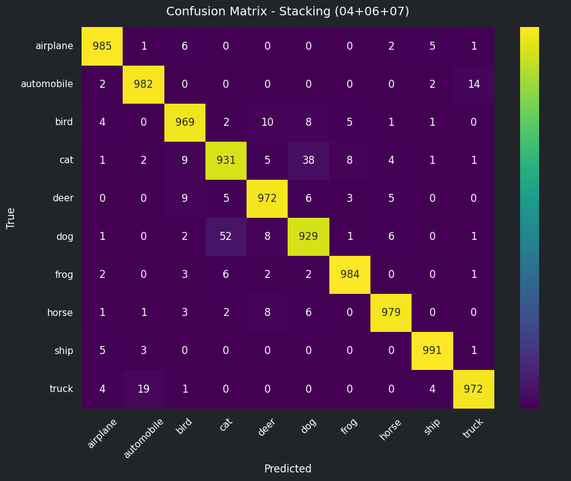
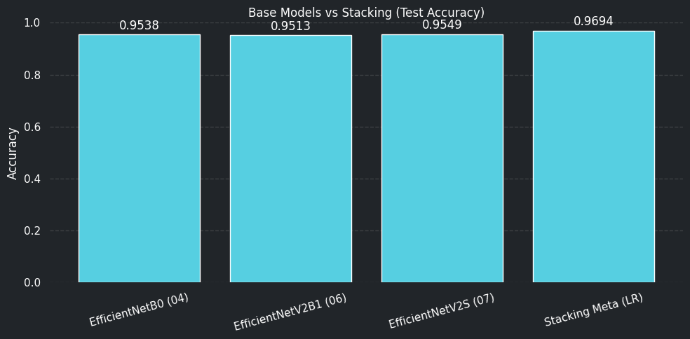

# Francesinha Meta-Model Training (04 + 06 + 07)

Trains and saves a Logistic Regression meta-model using base predictions from EfficientNetB0, EfficientNetV2B1, and EfficientNetV2S (PyTorch).

## 1. Imports and Setup


```python
import os
import sys
import time
from pathlib import Path

import numpy as np
import pandas as pd
import matplotlib.pyplot as plt

import tensorflow as tf
import torch
import torch.nn as nn
from torch.utils.data import DataLoader, Dataset
from torchvision import models, transforms

from sklearn.linear_model import LogisticRegression
from sklearn.metrics import log_loss
import joblib

# Resolve project root for utils import
cwd = Path.cwd()
if cwd.name.lower() == "notebooks":
    PROJECT_ROOT = cwd.parent
elif cwd.name.lower() == "cifar10_project":
    PROJECT_ROOT = cwd
elif (cwd / "cifar10_project").is_dir():
    PROJECT_ROOT = cwd / "cifar10_project"
else:
    PROJECT_ROOT = cwd

if str(PROJECT_ROOT) not in sys.path:
    sys.path.insert(0, str(PROJECT_ROOT))

from utils.ml_utils import (
    normalize_splits,
    compute_classification_metrics,
    build_classification_report,
    compute_confusion_matrix,
    plot_confusion_matrix_notebook01,
    apply_notebook01_plot_style,
    log_metrics_to_csv,
    format_duration,
)

# CUDA dynamic libs workaround for mixed TF/PyTorch in Linux/WSL
if sys.platform.startswith("linux") and "VIRTUAL_ENV" in os.environ:
    py_ver = f"python{sys.version_info.major}.{sys.version_info.minor}"
    site_packages = Path(os.environ["VIRTUAL_ENV"]) / "lib" / py_ver / "site-packages"
    nvidia_lib_dirs = [str(path) for path in (site_packages / "nvidia").glob("*/lib") if path.is_dir()]
    if nvidia_lib_dirs:
        previous = os.environ.get("LD_LIBRARY_PATH", "")
        os.environ["LD_LIBRARY_PATH"] = ":".join(nvidia_lib_dirs + ([previous] if previous else []))

print("TF:", tf.__version__)
print("Torch:", torch.__version__)
print("Project root:", PROJECT_ROOT)
```

    TF: 2.16.1
    Torch: 2.5.1+cpu
    Project root: /mnt/c/Users/User/Documents/Bootcamp AI and Data Science/Linux/DataScience_ironhack/Week6/project/cifar10_project


## 2. Paths and Data


```python
cwd = Path.cwd()
if cwd.name.lower() == "notebooks":
    PROJECT_ROOT = cwd.parent
elif cwd.name.lower() == "cifar10_project":
    PROJECT_ROOT = cwd
elif (cwd / "cifar10_project").is_dir():
    PROJECT_ROOT = cwd / "cifar10_project"
else:
    PROJECT_ROOT = cwd

if str(PROJECT_ROOT) not in sys.path:
    sys.path.insert(0, str(PROJECT_ROOT))

PROCESSED_DIR = PROJECT_ROOT / "data" / "processed"
DATA_DIR = PROJECT_ROOT / "data"
MODELS_DIR = PROJECT_ROOT / "models"
REPORTS_DIR = PROJECT_ROOT / "reports"
IMAGES_DIR = PROJECT_ROOT / "images"
FRANCESINHA_DATA_DIR = DATA_DIR / "francesinha"

REPORTS_DIR.mkdir(parents=True, exist_ok=True)
MODELS_DIR.mkdir(parents=True, exist_ok=True)
IMAGES_DIR.mkdir(parents=True, exist_ok=True)
FRANCESINHA_DATA_DIR.mkdir(parents=True, exist_ok=True)

data_path = PROCESSED_DIR / "cifar10_processed.npz"
performance_report_path = DATA_DIR / "model_performance_report.csv"

model_04_path = MODELS_DIR / "efficientnetb0_cifar10_tuned.keras"
model_06_path = MODELS_DIR / "EfficientNetV2B1_cifar10_tuned.keras"
model_07_path = MODELS_DIR / "efficientnetv2s_cifar10_tuned.pt"

for model_path in [model_04_path, model_06_path, model_07_path]:
    if not model_path.exists():
        raise FileNotFoundError(f"Model not found: {model_path}")

data = np.load(data_path)
x_train = data["x_train"].astype(np.float32)
y_train = np.squeeze(data["y_train"]).astype(np.int64)
x_val = data["x_val"].astype(np.float32)
y_val = np.squeeze(data["y_val"]).astype(np.int64)
x_test = data["x_test"].astype(np.float32)
y_test = np.squeeze(data["y_test"]).astype(np.int64)

raw_max = float(max(x_train.max(), x_val.max(), x_test.max()))
if raw_max > 1.5:
    splits = normalize_splits({
        "x_train": x_train,
        "x_val": x_val,
        "x_test": x_test,
    }, scale=255.0, dtype="float32", clip_range=(0.0, 1.0))
    x_train, x_val, x_test = splits["x_train"], splits["x_val"], splits["x_test"]
    print("Applied normalization from [0,255] to [0,1].")
else:
    print("Data already in [0,1]. Skipping extra normalization.")

class_names = [
    "airplane", "automobile", "bird", "cat", "deer",
    "dog", "frog", "horse", "ship", "truck"
]
num_classes = len(class_names)

print("x_train:", x_train.shape, "y_train:", y_train.shape)
print("x_val:", x_val.shape, "y_val:", y_val.shape)
print("x_test:", x_test.shape, "y_test:", y_test.shape)
```

    Data already in [0,1]. Skipping extra normalization.
    x_val: (10000, 32, 32, 3) y_val: (10000,)
    x_test: (10000, 32, 32, 3) y_test: (10000,)
    x ranges: train[0.0000,1.0000] val[0.0000,1.0000] test[0.0000,1.0000]


## 3. Load the 3 Base Models


```python
# Keras models (04, 06)
model_04 = tf.keras.models.load_model(model_04_path, safe_mode=False, compile=False)
model_06 = tf.keras.models.load_model(model_06_path, safe_mode=False, compile=False)

def resolve_keras_image_size(model, fallback=96):
    shape = getattr(model, "input_shape", None)
    if isinstance(shape, list):
        shape = shape[0]
    if shape is None or len(shape) < 3 or shape[1] is None:
        return fallback
    return int(shape[1])

IMG_04 = resolve_keras_image_size(model_04, fallback=96)
IMG_06 = resolve_keras_image_size(model_06, fallback=128)

# PyTorch model (07)
device = torch.device("cuda" if torch.cuda.is_available() else "cpu")

def build_torch_v2s(num_classes=10):
    net = models.efficientnet_v2_s(weights=None)
    in_features = net.classifier[1].in_features
    net.classifier = nn.Sequential(
        nn.Dropout(p=0.4),
        nn.Linear(in_features, num_classes),
    )
    return net

model_07 = build_torch_v2s(num_classes=num_classes)
checkpoint_07 = torch.load(model_07_path, map_location=device)
state_dict = checkpoint_07.get("model_state_dict", checkpoint_07)
model_07.load_state_dict(state_dict, strict=True)
model_07 = model_07.to(device)
model_07.eval()

print(f"Model 04 input size: {IMG_04}")
print(f"Model 06 input size: {IMG_06}")
print("Model 07 loaded on:", device)
```

    /tmp/ipykernel_25793/1588054755.py:29: FutureWarning: You are using `torch.load` with `weights_only=False` (the current default value), which uses the default pickle module implicitly. It is possible to construct malicious pickle data which will execute arbitrary code during unpickling (See https://github.com/pytorch/pytorch/blob/main/SECURITY.md#untrusted-models for more details). In a future release, the default value for `weights_only` will be flipped to `True`. This limits the functions that could be executed during unpickling. Arbitrary objects will no longer be allowed to be loaded via this mode unless they are explicitly allowlisted by the user via `torch.serialization.add_safe_globals`. We recommend you start setting `weights_only=True` for any use case where you don't have full control of the loaded file. Please open an issue on GitHub for any issues related to this experimental feature.
      checkpoint_07 = torch.load(model_07_path, map_location=device)


    Model 04 input size: 96
    Model 06 input size: 96
    Model 07 loaded on: cpu


## 4. Inference Functions and Meta-Features


```python
def predict_proba_keras(model, x, image_size, batch_size=128):
    x_resized = tf.image.resize(x, (image_size, image_size)).numpy()
    probs = model.predict(x_resized, batch_size=batch_size, verbose=0)
    return np.asarray(probs, dtype=np.float32)

class CifarTorchEvalDataset(Dataset):
    def __init__(self, images, labels, image_size=96):
        self.images = images
        self.labels = labels
        self.transform = transforms.Compose([
            transforms.Resize((image_size, image_size)),
            transforms.Normalize(mean=[0.485, 0.456, 0.406], std=[0.229, 0.224, 0.225]),
        ])

    def __len__(self):
        return len(self.images)

    def __getitem__(self, idx):
        image = torch.from_numpy(self.images[idx]).permute(2, 0, 1).float()
        image = self.transform(image)
        label = int(self.labels[idx])
        return image, label

def predict_proba_torch(model, x, y, image_size=96, batch_size=128):
    dataset = CifarTorchEvalDataset(x, y, image_size=image_size)
    loader = DataLoader(dataset, batch_size=batch_size, shuffle=False, num_workers=2, pin_memory=True)

    all_probs = []
    with torch.no_grad():
        for xb, _ in loader:
            xb = xb.to(device, non_blocking=True)
            logits = model(xb)
            probs = torch.softmax(logits, dim=1).cpu().numpy()
            all_probs.append(probs)

    return np.concatenate(all_probs, axis=0).astype(np.float32)

def build_meta_features(p1, p2, p3):
    return np.concatenate([p1, p2, p3], axis=1).astype(np.float32)
```

## 5. Generate Base Predictions and Train Meta-Classifier


```python
start_time = time.time()

# Validation probabilities (train meta-model)
p04_val = predict_proba_keras(model_04, x_val, image_size=IMG_04)
p06_val = predict_proba_keras(model_06, x_val, image_size=IMG_06)
p07_val = predict_proba_torch(model_07, x_val, y_val, image_size=96)

# Test probabilities (final evaluation)
p04_test = predict_proba_keras(model_04, x_test, image_size=IMG_04)
p06_test = predict_proba_keras(model_06, x_test, image_size=IMG_06)
p07_test = predict_proba_torch(model_07, x_test, y_test, image_size=96)

print("Pred shapes (val):", p04_val.shape, p06_val.shape, p07_val.shape)
print("Pred shapes (test):", p04_test.shape, p06_test.shape, p07_test.shape)

if not (len(p04_test) == len(p06_test) == len(p07_test) == len(y_test)):
    raise ValueError(
        f"Prediction size mismatch: p04={len(p04_test)}, p06={len(p06_test)}, p07={len(p07_test)}, y_test={len(y_test)}"
    )

X_meta_val = build_meta_features(p04_val, p06_val, p07_val)
X_meta_test = build_meta_features(p04_test, p06_test, p07_test)

meta_model = LogisticRegression(
    max_iter=5000,
    multi_class="multinomial",
    solver="lbfgs",
    n_jobs=-1,
    random_state=42,
 )
meta_model.fit(X_meta_val, y_val)

francesinha_probs_test = meta_model.predict_proba(X_meta_test)
francesinha_pred_test = np.argmax(francesinha_probs_test, axis=1)

# Base model predictions for comparison
pred04_test = np.argmax(p04_test, axis=1)
pred06_test = np.argmax(p06_test, axis=1)
pred07_test = np.argmax(p07_test, axis=1)

elapsed_sec = time.time() - start_time
print("Meta feature shapes:", X_meta_val.shape, X_meta_test.shape)
print(f"Francesinha pipeline time: {elapsed_sec:.2f} sec")
```

    Pred shapes (val): (10000, 10) (10000, 10) (10000, 10)
    Pred shapes (test): (10000, 10) (10000, 10) (10000, 10)


    /home/user/venvs/cifar10-gpu/lib/python3.12/site-packages/sklearn/linear_model/_logistic.py:1247: FutureWarning: 'multi_class' was deprecated in version 1.5 and will be removed in 1.7. From then on, it will always use 'multinomial'. Leave it to its default value to avoid this warning.
      warnings.warn(


    Meta feature shapes: (10000, 30) (10000, 30)
    Francesinha pipeline time: 83.07 sec


## 6. Metrics and Reports


```python
metrics_04 = compute_classification_metrics(y_test, pred04_test, average="macro")
metrics_06 = compute_classification_metrics(y_test, pred06_test, average="macro")
metrics_07 = compute_classification_metrics(y_test, pred07_test, average="macro")
metrics_francesinha = compute_classification_metrics(y_test, francesinha_pred_test, average="macro")

print("=== Classification Report: Francesinha ===")
print(build_classification_report(y_test, francesinha_pred_test, target_names=class_names, digits=4))

results_df = pd.DataFrame([
    {"model": "EfficientNetB0 (04)", **metrics_04},
    {"model": "EfficientNetV2B1 (06)", **metrics_06},
    {"model": "EfficientNetV2S (07)", **metrics_07},
    {"model": "Francesinha Meta (LR)", **metrics_francesinha},
])
display(results_df)
```

    === Classification Report: Francesinha ===
                  precision    recall  f1-score   support
    
        airplane     0.9801    0.9850    0.9825      1000
      automobile     0.9742    0.9820    0.9781      1000
            bird     0.9671    0.9690    0.9680      1000
             cat     0.9329    0.9310    0.9319      1000
            deer     0.9672    0.9720    0.9696      1000
             dog     0.9393    0.9290    0.9341      1000
            frog     0.9830    0.9840    0.9835      1000
           horse     0.9819    0.9790    0.9805      1000
            ship     0.9871    0.9910    0.9890      1000
           truck     0.9808    0.9720    0.9764      1000
    
        accuracy                         0.9694     10000
       macro avg     0.9694    0.9694    0.9694     10000
    weighted avg     0.9694    0.9694    0.9694     10000
    


<div>
<style scoped>
    .dataframe tbody tr th:only-of-type {
        vertical-align: middle;
    }

    .dataframe tbody tr th {
        vertical-align: top;
    }

    .dataframe thead th {
        text-align: right;
    }
</style>
<table border="1" class="dataframe">
  <thead>
    <tr style="text-align: right;">
      <th></th>
      <th>model</th>
      <th>accuracy</th>
      <th>precision</th>
      <th>recall</th>
      <th>f1</th>
      <th>support</th>
    </tr>
  </thead>
  <tbody>
    <tr>
      <th>0</th>
      <td>EfficientNetB0 (04)</td>
      <td>0.9538</td>
      <td>0.953530</td>
      <td>0.9538</td>
      <td>0.953584</td>
      <td>10000</td>
    </tr>
    <tr>
      <th>1</th>
      <td>EfficientNetV2B1 (06)</td>
      <td>0.9513</td>
      <td>0.951178</td>
      <td>0.9513</td>
      <td>0.951039</td>
      <td>10000</td>
    </tr>
    <tr>
      <th>2</th>
      <td>EfficientNetV2S (07)</td>
      <td>0.9549</td>
      <td>0.955047</td>
      <td>0.9549</td>
      <td>0.954819</td>
      <td>10000</td>
    </tr>
    <tr>
      <th>3</th>
      <td>Francesinha Meta (LR)</td>
      <td>0.9694</td>
      <td>0.969358</td>
      <td>0.9694</td>
      <td>0.969370</td>
      <td>10000</td>
    </tr>
  </tbody>
</table>
</div>


## 7. Plots


```python
cm_francesinha = compute_confusion_matrix(y_test, francesinha_pred_test)
conf_path = IMAGES_DIR / "francesinha_confusion_matrix.png"
plot_confusion_matrix_notebook01(
    confusion=cm_francesinha,
    class_names=class_names,
    title="Confusion Matrix - Francesinha (04+06+07)",
    save_path=conf_path,
    dpi=300,
)

fig, ax = plt.subplots(figsize=(10, 5))
apply_notebook01_plot_style(fig, ax, grid_axis="y")
bars = ax.bar(results_df["model"], results_df["accuracy"], color="#56cfe1")
ax.set_ylabel("Accuracy")
ax.set_title("Base Models vs Francesinha (Test Accuracy)")
ax.set_ylim(0, 1.0)
ax.tick_params(axis="x", rotation=15)

for bar in bars:
    h = bar.get_height()
    ax.text(
        bar.get_x() + bar.get_width() / 2,
        h + 0.01,
        f"{h:.4f}",
        ha="center",
        va="bottom",
        color="white",
    )

acc_path = IMAGES_DIR / "francesinha_accuracy_comparison.png"
plt.tight_layout()
plt.savefig(acc_path, dpi=300)
plt.show()

print("Saved confusion matrix to:", conf_path)
print("Saved comparison chart to:", acc_path)
```


    

    


    

    


    Saved confusion matrix to: /mnt/c/Users/User/Documents/Bootcamp AI and Data Science/Linux/DataScience_ironhack/Week6/project/cifar10_project/reports/francesinha_confusion_matrix.png
    Saved comparison chart to: /mnt/c/Users/User/Documents/Bootcamp AI and Data Science/Linux/DataScience_ironhack/Week6/project/cifar10_project/reports/francesinha_accuracy_comparison.png


## 8. Logging and Persistence (Save Pretrained Meta-Model)


```python
francesinha_logloss = float(log_loss(y_test, francesinha_probs_test, labels=np.arange(num_classes)))
meta_num_params = int(meta_model.coef_.size + meta_model.intercept_.size)

row = {
    "model_name": "Francesinha Ensemble (EffB0+EffV2B1+EffV2S -> LogisticRegression)",
    "num_params": meta_num_params,
    "train_time_sec": float(round(elapsed_sec, 2)),
    "train_time": format_duration(elapsed_sec),
    "timestamp": pd.Timestamp.now().strftime("%Y-%m-%d %H:%M"),
    "accuracy": float(metrics_francesinha["accuracy"]),
    "precision": float(metrics_francesinha["precision"]),
    "recall": float(metrics_francesinha["recall"]),
    "f1": float(metrics_francesinha["f1"]),
    "support": int(metrics_francesinha["support"]),
    "final_accuracy": None,
    "final_loss": None,
    "final_val_accuracy": None,
    "final_val_loss": None,
    "final_learning_rate": None,
    "epochs_trained": 1,
    "test_loss": francesinha_logloss,
    "framework": "francesinha_ensemble",
}

_ = log_metrics_to_csv(performance_report_path, row, append=True)
print("Logged row:")
print(row)

meta_model_path = MODELS_DIR / "francesinha_meta_logreg.joblib"
joblib.dump(meta_model, meta_model_path)

meta_features_path = FRANCESINHA_DATA_DIR / "francesinha_meta_features_test.npz"
np.savez_compressed(
    meta_features_path,
    X_meta_test=X_meta_test,
    y_test=y_test,
    francesinha_probs_test=francesinha_probs_test,
    francesinha_pred_test=francesinha_pred_test,
)

print("Saved meta model to:", meta_model_path)
print("Saved meta features to:", meta_features_path)
```

    Logged row:
    {'model_name': 'Francesinha Ensemble (EffB0+EffV2B1+EffV2S -> LogisticRegression)', 'num_params': 310, 'train_time_sec': 83.07, 'train_time': '1 min 23 sec', 'timestamp': '2026-02-20 09:49', 'accuracy': 0.9694, 'precision': 0.9693576350157972, 'recall': 0.9693999999999999, 'f1': 0.9693703687779447, 'support': 10000, 'final_accuracy': None, 'final_loss': None, 'final_val_accuracy': None, 'final_val_loss': None, 'final_learning_rate': None, 'epochs_trained': 1, 'test_loss': 0.11614491699301288, 'framework': 'francesinha_ensemble'}
    Saved meta model to: /mnt/c/Users/User/Documents/Bootcamp AI and Data Science/Linux/DataScience_ironhack/Week6/project/cifar10_project/models/francesinha_meta_logreg.joblib
    Saved meta features to: /mnt/c/Users/User/Documents/Bootcamp AI and Data Science/Linux/DataScience_ironhack/Week6/project/cifar10_project/reports/francesinha_meta_features_test.npz


    /mnt/c/Users/User/Documents/Bootcamp AI and Data Science/Linux/DataScience_ironhack/Week6/project/cifar10_project/utils/ml_utils.py:268: FutureWarning: The behavior of DataFrame concatenation with empty or all-NA entries is deprecated. In a future version, this will no longer exclude empty or all-NA columns when determining the result dtypes. To retain the old behavior, exclude the relevant entries before the concat operation.
      combined = pd.concat([existing, frame], ignore_index=True, sort=False)

